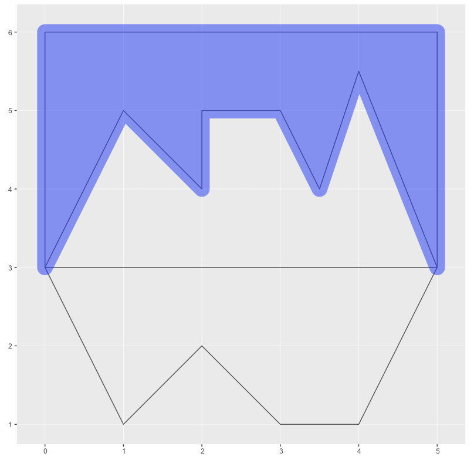

# Species mapping in R
Not much here at the moment. Just some code snippets that I wrote when I was getting my head around polygon operations while I was creating maps of species geographic ranges. The context of this code is that we have two shapes: the `mainland`, which might represent Australia; and the `range`, which is a polygon that represents the geographical distribution of the species we're interested in. To make pretty maps, you want to clip the `range` so that it only covers `mainland` (for terrestrial species) or so that it only covers the ocean (marine species).

Note that this code does not deal with species distribution modelling.

# The code

Load packages we want to use
```R
library(sf)
library(ggplot2)
```

Define some colours for plotting:
```R
red    <- '#f90000'
blue   <- '#0035f9'
purple <- '#8900f9'
green  <- '#00ff00'
```

Make our `mainland` polygon:
```R
aPts <- c(1,1, 2,2, 3,1, 4,1, 5,3, 4,5.5, 3.5,4, 3,5, 2,5, 2,4, 1,5, 0,3, 1,1)
aPts <- matrix(aPts, ncol=2, byrow=T)
a <- st_polygon(list(aPts))
```

Make our species `range` polygon:
```R
bPts <- c(0,3, 5,3, 5,6, 0,6, 0,3)
bPts <- matrix(bPts, ncol=2, byrow=T)
b <- st_polygon(list(bPts))
```

Convert them to Simple Features and combine:
```R
# set agr to constant so we don't get warnings in st_intersection
a <- st_sf(data.frame(name='mainland', geom=st_sfc(a)), agr='constant')
b <- st_sf(data.frame(name='range', geom=st_sfc(b)), agr='constant')
both <- rbind(a, b)
```

Plot our constituent polygons. `mainland` is red. `range` is blue. Overlap is purple:
```R
ggplot() + geom_sf(data=both, fill=c(red, blue), alpha=0.5)
```


# Perform a few geometry operations and plot the results.
Clip so that we only get parts of `range` that fall on `mainland`. Useful for terrestrial species.
```R
intersectAB <- st_intersection(a, b) # returns the overlap between a and b. Order doesn't matter.
ggplot() + geom_sf(data=both, fill=NA) + geom_sf(data=intersectAB, fill=purple, alpha=0.5)
```


Clip so that we only get parts of `mainland` that are outside `range`. Not useful for our purposes, but here to show that the order of parameters in `st_difference()` matters.
```R
differenceAB <- st_difference(a, b) # returns the parts of 'a' that are outside of 'b'
ggplot() + geom_sf(data=both, fill=NA) + geom_sf(data=differenceAB, fill=red, alpha=0.5)
```


Clip so that we only get parts of `range` that are outside of `mainland`. Useful for marine species.
```R
differenceBA <- st_difference(b, a) # returns the parts of 'b' that are outside of 'a'
ggplot() + geom_sf(data=both, fill=NA) + geom_sf(data=differenceBA, fill=blue, alpha=0.5)
```


As above, but with a buffer included to encompass a small amount of adjacent `mainland`.
```R
differenceBABuffer <- st_buffer(differenceBA, dist=0.1) # buffer differenceBA by 0.1 map units
ggplot() + geom_sf(data=both, fill=NA) + geom_sf(data=differenceBABuffer, color=NA, fill=red, alpha=0.5)
```

The `dist` parameter in `st_buffer()` is in map units. If you're working in geographical coordinates (e.g., degrees of latitude and longitude), you'll first need to use `st_transform()` to project your spatial data. For Australia, I would use `st_transform(differenceBA, 3577)` to transform my spatial data to the Australian Albers equal-area projection. My spatial data would then be in units of metres (i.e., Eastings and Northings in metres) and my `dist` parameter would be supplied in metres. So a buffer of 1km would be applied with `st_buffer(differenceBA, dist=1000)`.


Clip so that we get only parts that are not shared between `mainland` and `range`. Not useful for our purposes.
```R
symDiffAB <- st_sym_difference(a, b) # not sure if this one is useful for distribution mapping
ggplot() + geom_sf(data=both, fill=NA) + geom_sf(data=symDiffAB, color=NA, fill=green, alpha=0.5)
```

